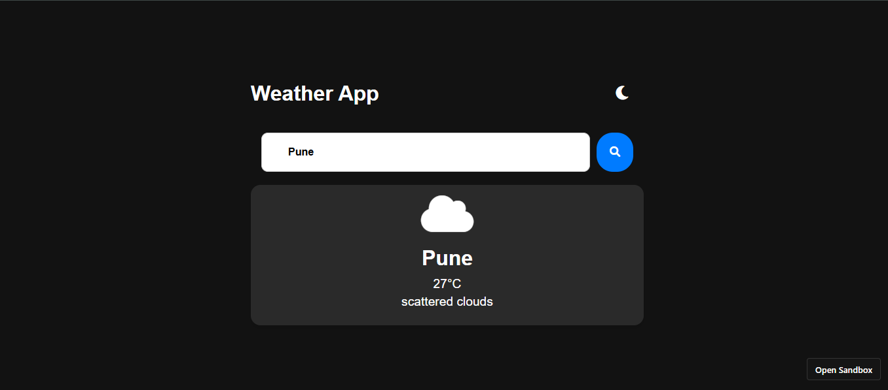
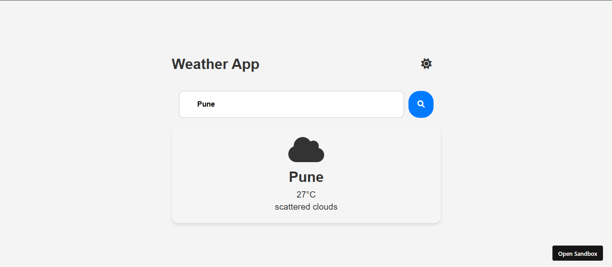

# 🌤️ Weather App

A simple Weather Application built using **HTML, CSS and JavaScript**.  
Users can search any city and get real-time weather information with **Light & Dark mode** support.

---

## 🚀 Features

- 🔍 Search weather by city name  
- 🌡️ Shows temperature in Celsius  
- ☁️ Displays weather condition (clouds, rain, etc.)  
- 🌙 Light & Dark mode  
- 📱 Responsive design  
- ⚡ Real-time API data

---

## 🖼️ Screenshots

### 🌙 Dark Mode

### ☀️ Light Mode

---

## 🛠️ Tech Stack

- HTML5  
- CSS3  
- JavaScript  
- OpenWeatherMap API

---

